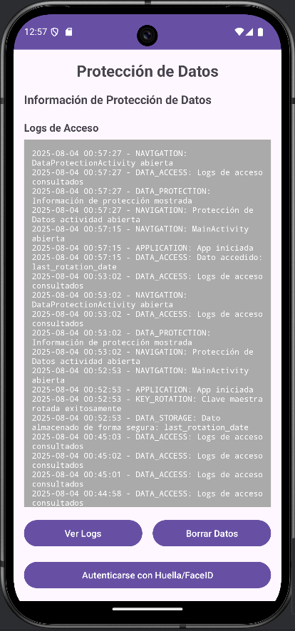

# Sistema de Seguridad y Protección de Datos

Este proyecto implementa un sistema completo de seguridad para una aplicación Android. El sistema se enfoca en la **protección de datos**, la **autenticación biométrica**, la **verificación de integridad de los datos**, la **auditoría avanzada**, y muchas otras medidas de seguridad clave.

  
  
  

## 1. Fortalecimiento de la Encriptación

### Descripción

La clase `DataProtectionManager.kt` ha sido modificada para incluir varias mejoras de seguridad en la encriptación de los datos:

- **Rotación automática de claves maestras cada 30 días**: Las claves de encriptación se rotan automáticamente cada 30 días para mejorar la seguridad.
- **Verificación de integridad de los datos encriptados**: Se utiliza HMAC (Hash-based Message Authentication Code) para verificar que los datos no hayan sido alterados.
- **Implementación de key derivation con salt único por usuario**: Se utiliza un salt único por usuario para derivar claves de encriptación y evitar ataques de diccionario.

### Funcionalidad

- **Rotación de claves**: La clave maestra de encriptación se rota cada 30 días para garantizar la seguridad a largo plazo.
- **Verificación de integridad**: Se implementa HMAC para garantizar que los datos no hayan sido modificados.
- **Key derivation**: La derivación de claves con un salt único por usuario asegura que cada usuario tenga una clave única.

---

## 2. Sistema de Auditoría Avanzado

### Descripción

Se implementa un sistema avanzado de auditoría para detectar **accesos sospechosos**, implementar **rate limiting** en operaciones sensibles, generar **alertas** cuando se detecten patrones anómalos y exportar **logs firmados digitalmente**.

### Funcionalidad

- **Detección de actividad sospechosa**: Detecta múltiples solicitudes en corto tiempo y genera alertas en caso de detectar actividad sospechosa.
- **Rate limiting**: Limita la cantidad de solicitudes por usuario dentro de un período de tiempo.
- **Alertas**: Genera alertas cuando se detectan patrones anómalos, como múltiples intentos fallidos de inicio de sesión.
- **Exportación de logs firmados digitalmente**: Los logs de auditoría se exportan en formato JSON, firmados digitalmente para garantizar su integridad.

---

## 3. Biometría y Autenticación

### Descripción

La clase `DataProtectionActivity.kt` se ha modificado para integrar la **autenticación biométrica**. Si la biometría no está disponible, se proporciona un **fallback** a un PIN o patrón. Además, se implementa un **timeout de sesión** para finalizar la sesión después de 5 minutos de inactividad.

### Funcionalidad

- **Autenticación biométrica**: Se utiliza la API de `BiometricPrompt` para autenticar al usuario mediante huella dactilar o reconocimiento facial.
- **Fallback a PIN/Patrón**: Si la biometría no está disponible, se solicita un PIN o patrón de desbloqueo.
- **Timeout de sesión**: La sesión caduca después de 5 minutos de inactividad.

---

## 4. Protección Contra Ingeniería Inversa

### Descripción

El sistema implementa varias medidas para proteger la aplicación contra **ingeniería inversa**. Estas incluyen la **detección de debugging activo**, **detección de emuladores**, la **ofuscación de datos sensibles** y **verificación de la firma digital**.

### Funcionalidad

- **Detección de debugging y emuladores**: Se verifica si la aplicación está siendo ejecutada en un entorno de depuración o en un emulador.
- **Obfuscación de cadenas sensibles**: Las cadenas de texto sensibles, como las claves criptográficas, se ofuscan para evitar su extracción.
- **Verificación de firma digital**: Se asegura que la aplicación no haya sido modificada, verificando su firma digital.
- **Certificate Pinning**: Se asegura que las conexiones seguras utilicen certificados pinneados específicos.

---

## 5. Anonimización Avanzada de Datos

### Descripción

El sistema implementa técnicas avanzadas de anonimización de datos. Esto incluye la implementación de **k-anonimity**, **l-diversity**, **differential privacy**, **data masking** y **políticas de retención configurables**.

### Funcionalidad

- **k-anonimity y l-diversity**: Garantiza que los datos no sean identificables a nivel individual, mediante el agrupamiento de registros.
- **Differential Privacy**: Añade ruido a los datos para proteger la privacidad de las personas al realizar análisis agregados.
- **Data Masking**: Aplica enmascaramiento de datos según el tipo de información, como nombres, direcciones y números de teléfono.
- **Políticas de retención configurables**: Los datos se retienen solo durante el tiempo necesario, según las políticas configuradas.

---

## 6. Implementación de Zero-Trust Architecture

### Descripción

La **Zero-Trust Architecture** asegura que ningún dispositivo ni usuario dentro de la red sea de confianza de manera predeterminada. Se validan todas las solicitudes y se aplica el principio de **menor privilegio** en cada operación.

### Funcionalidad

- **Tokens JWT**: Para autenticar a los usuarios, utilizando JWT con expiración.
- **Verificación de la integridad de la aplicación**: Se verifica la integridad de la aplicación usando la **Google Play Integrity API**.
- **Principio de menor privilegio**: Se controlan los permisos de acceso de acuerdo con el rol del usuario (ADMIN, USER, GUEST).

---

## 7. Análisis Forense y Compliance

### Descripción

Se implementa un sistema de **análisis forense** para asegurar que las evidencias digitales sean manipuladas correctamente. Además, se generan **reportes de cumplimiento** con **GDPR** y **CCPA**.

### Funcionalidad

- **Cadena de custodia**: Se mantiene un registro completo de las evidencias y sus modificaciones.
- **Logs tamper-evident**: Utiliza **blockchain local** para garantizar que los logs no puedan ser modificados.
- **Reportes de compliance**: Generación de reportes automáticos de cumplimiento con las normativas **GDPR** y **CCPA**.

---

## Conclusión

Este sistema de seguridad ofrece una protección avanzada para una aplicación Android, con un enfoque integral que incluye la protección de datos, la autenticación, la verificación de la integridad de los datos, y el cumplimiento de normativas de privacidad como el **GDPR** y **CCPA**. Con estas medidas implementadas, el sistema garantiza que los datos de los usuarios estén protegidos frente a posibles amenazas, al mismo tiempo que cumple con las normativas de seguridad y privacidad más estrictas.

Si tienes alguna pregunta o necesitas más detalles, no dudes en abrir un issue en el repositorio o contactar al equipo de desarrollo.
