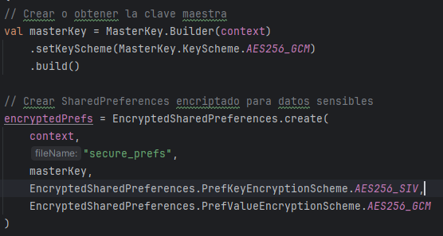

# Análisis de Seguridad Básico - Proyecto de Seguridad

Este proyecto tiene como objetivo implementar medidas de seguridad en una aplicación Android, incluyendo encriptación, autenticación, control de accesos, y análisis de seguridad.

## 1. Análisis de Seguridad Básico (0-7 puntos)

### 1.1 Identificación de Vulnerabilidades (2 puntos)

#### 1.1.1 ¿Qué método de encriptación se utiliza para proteger datos sensibles?

El sistema de encriptación utilizado para proteger los datos sensibles en este código es **AES-256-GCM**. Este es un algoritmo de cifrado simétrico que utiliza una clave de 256 bits, y es ampliamente reconocido por su seguridad y eficiencia.

<div align="center">
  
</div>

#### 1.1.2 ¿Cuáles son las vulnerabilidades en la implementación actual del logging?

1. **Logs no encriptados**: Los logs de acceso se almacenan en un archivo **SharedPreferences** normal (no encriptado) a través de `accessLogPrefs`. Esto significa que, en caso de que un atacante tenga acceso a las preferencias del dispositivo, podría leer los logs de acceso, lo cual podría incluir información sensible sobre las operaciones realizadas en el sistema.

<div align="center">
  
</div>

2. **Recorte de logs sin filtrado de datos sensibles**: El código recorta los logs manteniendo solo las últimas 100 entradas. Sin embargo, el recorte es realizado sin verificar si esos logs contienen datos sensibles como nombres de usuario, contraseñas o información personal. Esto podría dar lugar a una exposición no intencionada de datos sensibles si esos logs contienen detalles relevantes.

<div align="center">
  
</div>

#### 1.1.3 ¿Qué sucede si falla la inicialización del sistema de encriptación?

Si la inicialización del sistema de encriptación falla (por ejemplo, al generar la clave maestra o crear las preferencias encriptadas), el sistema cae en un **modo de respaldo**:
- Se utilizarán **SharedPreferences** no encriptadas con el nombre "fallback_prefs" para almacenar los datos sensibles.
- Para los logs de acceso, se utilizarán **SharedPreferences** normales con el nombre "access_logs".
Esto asegura que el sistema siga funcionando en una capacidad limitada, pero no protege los datos sensibles de la misma manera que en el modo de encriptación.

<div align="center">
  
</div>

### 1.2 Permisos y Manifiesto (2 puntos)

#### 1.2.1 Lista de permisos peligrosos declarados en el manifiesto

- `android.permission.CAMERA`: Permite el acceso a la cámara del dispositivo para tomar fotos o grabar videos.
- `android.permission.READ_EXTERNAL_STORAGE`: Permite leer el almacenamiento externo del dispositivo.
- `android.permission.READ_MEDIA_IMAGES`: Permite leer imágenes desde el almacenamiento del dispositivo.
- `android.permission.RECORD_AUDIO`: Permite grabar audio utilizando el micrófono.
- `android.permission.READ_CONTACTS`: Permite acceder a los contactos almacenados en el dispositivo.
- `android.permission.CALL_PHONE`: Permite realizar llamadas telefónicas desde la aplicación.
- `android.permission.SEND_SMS`: Permite enviar mensajes SMS desde la aplicación.
- `android.permission.ACCESS_COARSE_LOCATION`: Permite acceder a la ubicación aproximada del dispositivo.

#### 1.2.2 ¿Qué patrón se utiliza para solicitar permisos en runtime?

Se utiliza el patrón **ActivityResultContracts.RequestPermission()**, que facilita la solicitud de permisos en tiempo de ejecución. La lógica de solicitud está basada en un objeto `requestPermissionLauncher`, que solicita el permiso si aún no ha sido concedido y maneja el resultado mediante un callback (`isGranted`).

#### 1.2.3 Identifica qué configuración de seguridad previene backups automáticos

La siguiente configuración en el archivo **AndroidManifest.xml** previene los backups automáticos:

```xml
<application
    android:allowBackup="false"
    ... >
</application>
```

## 1.3 Gestión de Archivos (3 puntos)

### 1.3.1 ¿Cómo se implementa la compartición segura de archivos de imágenes?

La compartición segura de archivos de imágenes se implementa mediante el uso de **FileProvider**, que permite compartir archivos de manera segura entre aplicaciones sin exponer la ruta directa del archivo en el sistema de archivos.

El proceso es el siguiente:
1. Se genera un archivo de imagen en el almacenamiento privado de la aplicación utilizando la función `createImageFile()`.
2. Luego, se obtiene un URI seguro mediante `FileProvider.getUriForFile()`, lo que permite compartir el archivo con otras aplicaciones de manera controlada.

### 1.3.2 ¿Qué autoridad se utiliza para el FileProvider?

En el archivo **AndroidManifest.xml**, se define la autoridad para el **FileProvider** como:

```xml
<provider
    android:name="androidx.core.content.FileProvider"
    android:authorities="com.example.seguridad_priv_a.fileprovider"
    android:exported="false"
    android:grantUriPermissions="true">
</provider>
```

### 1.3.3 Explica por qué no se debe usar `file://` URIs directamente

El uso de **file:// URIs** se desaconseja por varias razones:

- **Exposición de la Ruta del Archivo**: Usar `file://` URIs expone la ruta completa del archivo en el sistema de archivos del dispositivo. Esto puede permitir que otras aplicaciones o usuarios malintencionados accedan a datos sensibles sin autorización. Usar `content://` URIs a través de un **FileProvider** protege la privacidad del usuario.

- **Restricciones de Seguridad en Android**: A partir de Android 7.0 (API nivel 24), se prohíbe el uso de `file://` URIs si el archivo no está dentro del sandbox de la aplicación. Esto da lugar a un error conocido como **FileUriExposedException**. Se recomienda usar `content://` URIs para evitar este tipo de errores y garantizar una mayor seguridad.

- **Compatibilidad entre Aplicaciones**: Los **content:// URIs** permiten compartir archivos de manera más segura entre aplicaciones. A través de un **FileProvider**, puedes controlar y restringir qué archivos pueden ser accedidos por otras aplicaciones, lo que no es posible al usar `file://` directamente.
